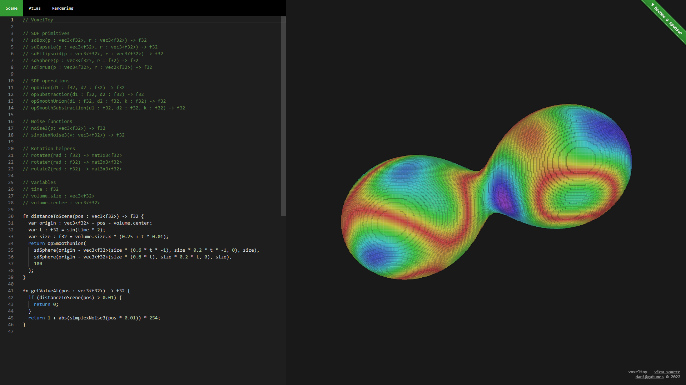

[voxeltoy](https://github.com/danielesteban/voxeltoy)
==

> SDF -> Voxels -> Faces -> Pixels (Works only in Chrome Canary)

[](https://voxeltoy.gatunes.com)

### Dev environment

```bash
# clone repo:
git clone https://github.com/danielesteban/voxeltoy.git
cd voxeltoy
# install dependencies:
npm install
# start environment:
npm start
# open http://localhost:8080/ in your browser
```
